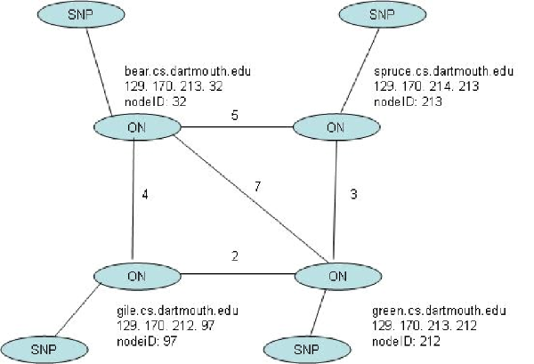
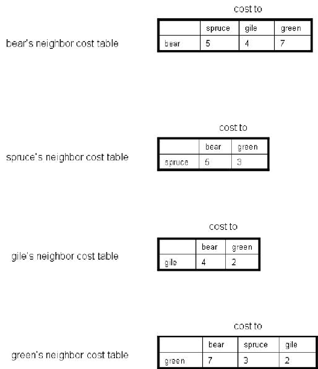
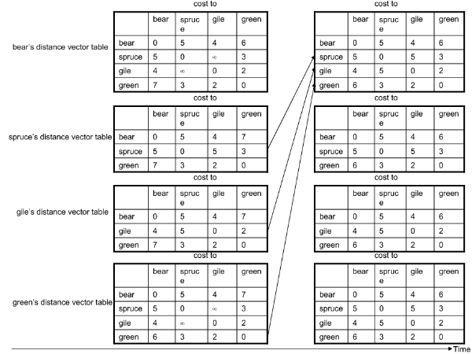
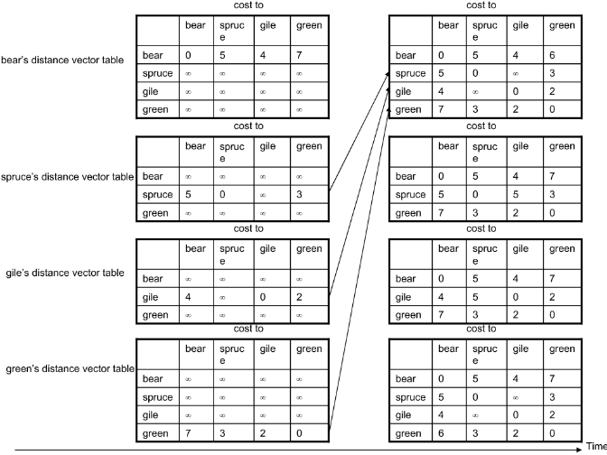
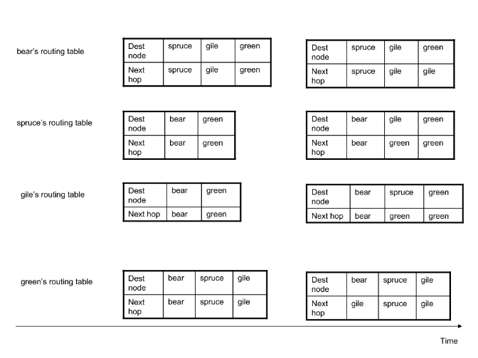
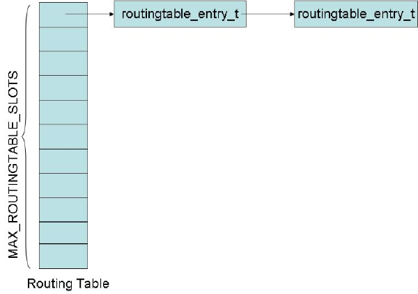

Network
======
February 27, 2016

```
SNP Packet Format 
SNP Routing Protocol
SNP Routing Algorithm
SNP API
```

SNP Packet Format
---------
```
//SNP packet format definition
typedef struct snpheader {
  int src_nodeID;		          //source node ID
  int dest_nodeID;		          //destination node ID
  unsigned short int length;	 //length of the data in the packet
  unsigned short int type;	    //type of the packet 
} snp_hdr_t;

typedef struct packet {
  snp_hdr_t header;
  char data[MAX_PKT_LEN];
} snp_pkt_t;
```

SNP Routing Protocol
---------
下图`DartNet topology`作为一个例子，从中得到`Cost`，`Distance Vector` ，`Routing`信息

`Neighbor Cost Tables`


`dv数据结构：`

```
//dv_entry_t structure definition
typedef struct distancevectorentry {
	int nodeID;		//destnation nodeID	
	unsigned int cost;	//cost to the destination
} dv_entry_t;


//A distance vector table contains the n+1 dv_t entries, where n is the number of the neighbors of this node, and the rest one is for this node itself. 
typedef struct distancevector {
	int nodeID;		//source nodeID
	dv_entry_t* dvEntry;	//an array of N dv_entry_ts, each of which contains the destination node ID and the cost to the destination from the source node. N is the total number of nodes in the overlay.
} dv_t;
```

`Distance Vector Tables in Step 1`

`Distance Vector Tables in Step 2`

`Routing Tables`



每一个结点的`SNP process` 包含一个 `routing table`. 路由表是一个`hash table` ，它包括`MAX_ROUTINGTABLE_SLOTS`个表项.每一个表项包含一个`routingtable_entry_t`结构的链表.

`Routing Table Structure`


SNP Routing Algorithm
----------
`The SNP routing protocol` 使用 `距离向量`路由算法.具体算法内容讲解请读`《计算机网络：自顶向下》4.5.2`: `The Distance-Vector (DV)`路由算法在书本的 `(p. 375 - p. 382)`, 书上有详细的介绍。

```
int routeUpdateHandler(snp_pkt_t* pkt) {
    
  int myNodeId = topology_getMyNodeID(), i, j;
  pkt_routeupdate_t* routeupdate = (pkt_routeupdate_t*)pkt->data;
  unsigned int nodeNum = routeupdate->entryNum;
  routeupdate_entry_t* entry;
  dv_entry_t* dvEntry;
  
  // step 1, update that particular entry
  pthread_mutex_lock(dv_mutex);
  for(j = 0; (dv+j) != NULL; j++) {
    if(dv[j].nodeID == pkt->header.src_nodeID) {
      for(i = 0; i < nodeNum; i++) {
        entry = routeupdate->entry;
        dv[j].dvEntry[i].cost = entry[i].cost;
      }
      break;
    }
  }
  pthread_mutex_unlock(dv_mutex);
  
  // step 2, update my own entry and update routing table
  pthread_mutex_lock(routingtable_mutex);
  for(j = 0; (dv+j) != NULL; j++) {
    if(dv[j].nodeID == myNodeId) {
      for(i = 0; i < nodeNum; i++) {
          dvEntry = dv[j].dvEntry;
          int newCost = dvtable_getcost(dv, myNodeId, pkt->header.src_nodeID) 
            + dvtable_getcost(dv, pkt->header.src_nodeID, dvEntry[i].nodeID);
          if(dvEntry[i].cost > newCost) {
            dvtable_setcost(dv, myNodeId, dvEntry[i].nodeID, newCost);
            routingtable_setnextnode(routingtable, dvEntry[i].nodeID, pkt->header.src_nodeID);
          }
      }
      break;
    }
  }
  pthread_mutex_unlock(routingtable_mutex);
  
  return 1;
}
```

SNP API
---------
```
Distance Vector Tables
neighbor cost table
Routing Tables 
```


`Distance Vector Tables`

`dv_t* dvtable_create():`

```
dv_t* dvtable_create()
{
  // initiate dvTable memory
  int i, j, nbrNum = topology_getNbrNum(), nodeNum = topology_getNodeNum();
  int myNodeId = topology_getMyNodeID();
  int* nodeIdArray = topology_getNodeArray();
  int* nbrIdArray = topology_getNbrArrayAndSelf();
  dv_t* dvTable = (dv_t*)malloc((nbrNum + 1) * sizeof(dv_t));
  
  for (i = 0; i < nbrNum + 1; i++) {
    dvTable[i].dvEntry = (dv_entry_t*)malloc(nodeNum * sizeof(dv_entry_t));
    dvTable[i].nodeID = nbrIdArray[i];
    for (j = 0; j < nodeNum; j++) {
      dvTable[i].dvEntry[j].nodeID = nodeIdArray[j];
      if(myNodeId == dvTable[i].nodeID) // if self, then add nbr cost {
        dvTable[i].dvEntry[j].cost = topology_getCost(dvTable[i].nodeID, nodeIdArray[j]);
      else  // if not self entry, then set infinite
        dvTable[i].dvEntry[j].cost = INFINITE_COST;
    }
  }
  return dvTable;
}
```

`以上创建dvtable分为两个部分:`

*建表*

```
dv_t* dvTable = (dv_t*)malloc((nbrNum + 1) * sizeof(dv_t));

dvTable[i].dvEntry = (dv_entry_t*)malloc(nodeNum * sizeof(dv_entry_t));
```

*填表*

```
dvTable[i].nodeID = nbrIdArray[i];
dvTable[i].dvEntry[j].nodeID = nodeIdArray[j];
// if self, then add nbr cost
if(myNodeId == dvTable[i].nodeID) 
   dvTable[i].dvEntry[j].cost = topology_getCost(dvTable[i].nodeID, nodeIdArray[j])     
   else  // if not self entry, then set infinite
   dvTable[i].dvEntry[j].cost = INFINITE_COST;
```

`void dvtable_destroy(dv_t* dvTable):`

```
void dvtable_destroy(dv_t* dvTable)
{
  if(dvTable != NULL) {
    int i, nbrNum = topology_getNbrNum();
    for(i = 0; i < nbrNum + 1; i++) {
      if(dvTable[i].dvEntry) {
        free(dvTable[i].dvEntry);
        dvTable[i].dvEntry = NULL;
      } else {
        fprintf(stderr, "err in file %s func %s line %d: dvTable[i].dvEntry is null.\n"
          , __FILE__, __func__, __LINE__); 
      }
    }
    free(dvTable);
    dvTable = NULL;
    return;
  }
  fprintf(stderr, "err in file %s func %s line %d: dvTable is null.\n"
    , __FILE__, __func__, __LINE__); 
  return;
}
```

`注意依次释放内存（几个malloc，就得对应几个free），并将指针赋值为null。释放内存前判断指针是否为空，提供详细的报错信息`

其他的API看源码具体实现，不再单独分析。

`neighbor cost table`

