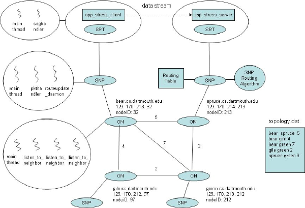
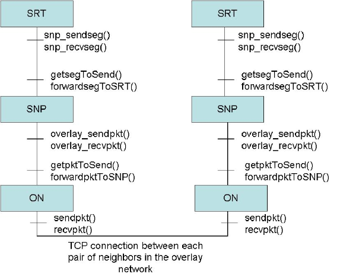
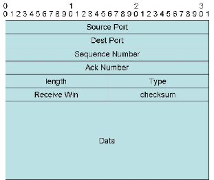
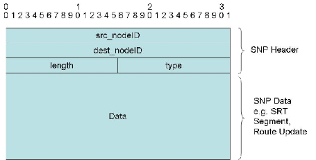
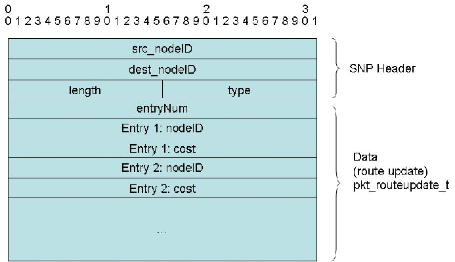
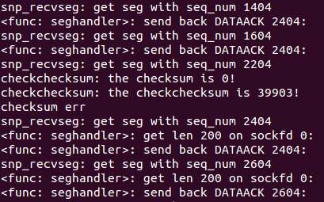
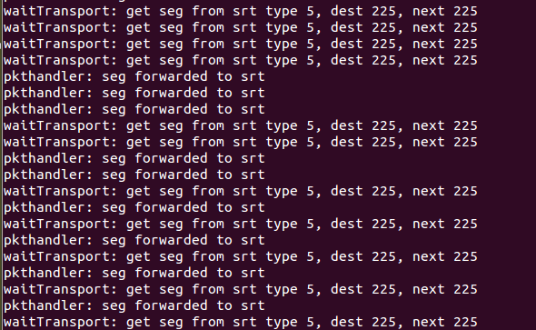
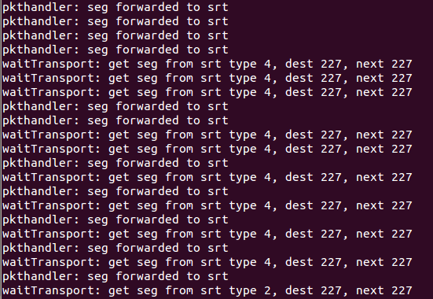
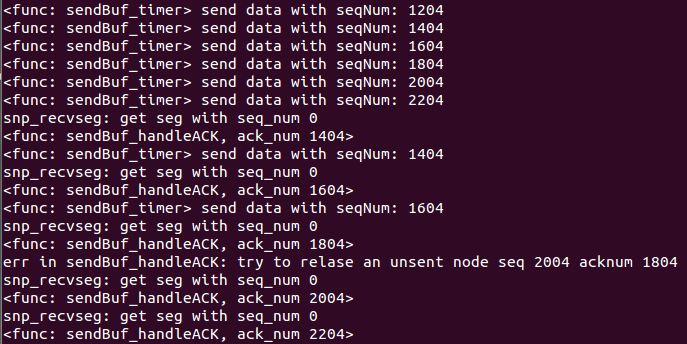

This is DartNet
====
February 26, 2016

```
DartNet
DartNet APIs
DartNet Packets Format
DartNet Debug Logs
```

DartNet
--------
`DartNet协议栈设计原理图:`




DartNet APIs
---------
`完整的DartNet APIs DartNet layers：` 



DartNet Packets Format
------

`Segment Header Format`



`Packet Format`


`Route Update Packet Format`



DartNet Debug Logs
-------



